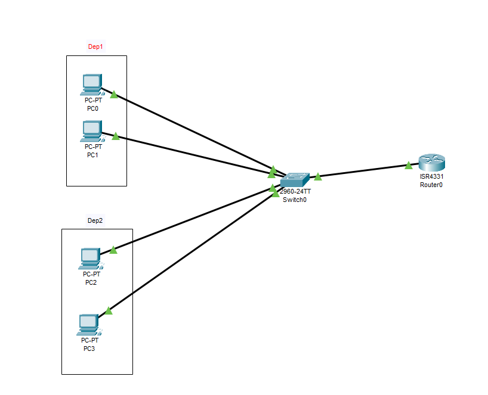

# Secure VLAN Network Project

## Overview
This project demonstrates a VLAN-based network design using Cisco Packet Tracer.  
The network is divided into two departments, each on a separate VLAN, with two different scenarios:

1. Connected Version – VLANs can communicate using Router-on-a-Stick.  
2. Isolated Version – VLANs are completely separated for security purposes.

---

## Network Topology

---

## Project Scenarios

### Scenario 1: Connected VLAN Network
- VLAN 10: Students Department  
- VLAN 20: Administration Department  
- Inter-VLAN Routing enabled using Cisco ISR4331 Router  
- Devices from different VLANs can communicate normally  

---

### Scenario 2: Isolated VLAN Network
- VLAN 10 and VLAN 20 are fully isolated  
- No communication is allowed between departments  
- This version demonstrates secure network segmentation  

---

## IP Addressing Scheme

| Department      | VLAN | Network           | Gateway         |
|-----------------|------|-------------------|-----------------|
| Students        | 10   | 192.168.10.0/24   | 192.168.10.1   |
| Administration  | 20   | 192.168.20.0/24   | 192.168.20.1   |

---

## Tools Used
- Cisco Packet Tracer
- Cisco 2960 Switch
- Cisco ISR4331 Router

---

## Files Included
- VLAN_Project_Connected.pkt  
- VLAN_Project_Isolated.pkt  
- README.md  
- topology.png  

---

## Author
This project demonstrates practical implementation of VLAN segmentation and inter-VLAN routing using Cisco technologies.
